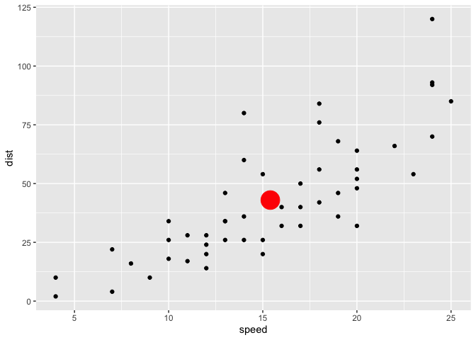
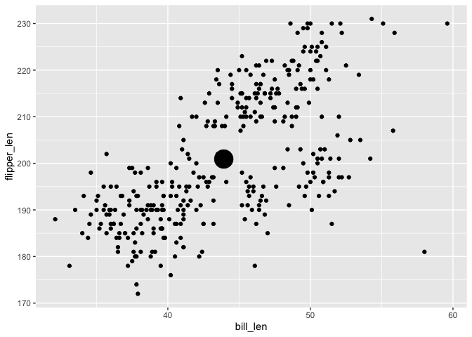
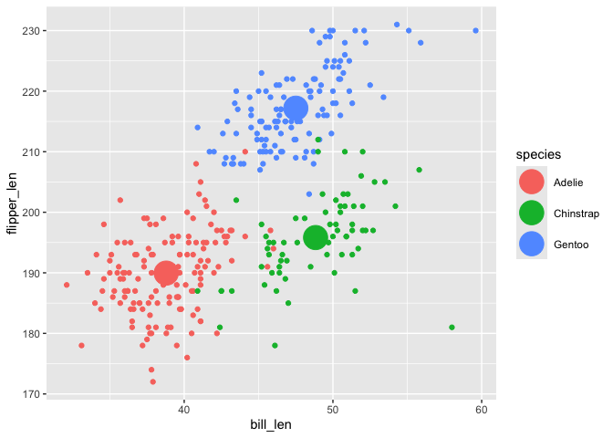

- [easy.geom.recipes.package](#easygeomrecipespackage)
- [Phase 00. Baseline knowledge: Recipes review…
  `geom_means()`](#phase-00-baseline-knowledge-recipes-review-geom_means)
  - [Step 0 Load packages](#step-0-load-packages)
  - [Step 1 Define Compute, Test](#step-1-define-compute-test)
  - [Step 2.a Define Stat object,
    Test](#step-2a-define-stat-object-test)
  - [Step 3. Define User-Facing Functions (w/ ggplot2 \>= v4.0),
    Test](#step-3-define-user-facing-functions-w-ggplot2--v40-test)
- [Packaging](#packaging)
  - [Phase 0. Set up package
    architecture](#phase-0-set-up-package-architecture)
  - [Phase 1. Documentation with
    Roxygen](#phase-1-documentation-with-roxygen)
  - [Phase 2. Writing Tests](#phase-2-writing-tests)
  - [Phase 3. Declaring dependencies](#phase-3-declaring-dependencies)
  - [Phase 4. Create .R files and test
    files.](#phase-4-create-r-files-and-test-files)
  - [Phase 5. Document your functions](#phase-5-document-your-functions)
  - [Phase 6. Check your package](#phase-6-check-your-package)
  - [Phase 7. Install your package](#phase-7-install-your-package)
- [Enjoy! You’ve created a ggplot2 extension
  package!](#enjoy-youve-created-a-ggplot2-extension-package)

<!-- README.md is generated from README.Rmd. Please edit that file -->

# easy.geom.recipes.package

<!-- badges: start -->

<!-- badges: end -->

The goal of the {easy.geom.recipes.package} is to expose folks to some
of the ‘moves’ to packaging a ggplot2 extension and specifically the
user-facing functions of the [easy-geom-recipes
tutorial](https://evamaerey.github.io/easy-geom-recipes/)

The ‘easy geom recipes’ are a new point of entry for people that are
ggplot2 users, which focuses on learning some extension that can help
you write `geom_*()` functions.

The recipes have been successful:

> I was never a “ggextender” myself until \[going through the recipes\]!
> …Easy geom recipes \[are\] a series of tutorials on creating ggplot2
> extensions. Following “recipes”, you methodically create three
> extensions. Each time, certain key knowledge points are reinforced and
> new variations are introduced. ‘R Works’ Isabella Velazqués

<!-- > I'm reading your [tutorial] on ggproto. Great writing - [it makes extension feel more accessible than other materials I've seen]. -->

> Just wanted to share that I’m spending some of my weekend reading your
> brilliant resource here. This is so well written and delightful as a
> resource; wish I had had it years ago and thrilled to know it now.
> Thank you for writing! - Emily Riederer

> The format works for me. I’ve read tutorials about creating extensions
> before but this one made it look easier and more intuitive. I want to
> try again writing my own! - Greg

However, the recipes intentionally do not cover any packaging
considerations (one thing at a time, right?.). Addressing packaging is
the topic of this repo. So that we can preserve a narrative about the
package, we’ll use a ‘literate program’ packaging style, where packaging
steps are recorded in a single document – in our case, the README.Rmd.
For an overview, you can look at the rendered (to html) .md file, but
for the full packaging ‘story’, you may later want to check out the
source `.Rmd` file.

# Phase 00. Baseline knowledge: Recipes review… `geom_means()`

So now we will not only write a user-facing function that works, we’ll
also make these functions available in the package
{easy.geom.recipes.package}. Packaging is not necessary to use extension
mechanisms - but if your extensions are particularly nice, you may find
it useful to access or share them via packaging.

Almost verbatim from the recipes, we go through the steps…

### Step 0 Load packages

``` r
library(ggplot2)
library(dplyr)
```

### Step 1 Define Compute, Test

``` r
compute_group_means <- function(data, scales){
  
  data |> 
    summarize(x = mean(x, na.rm = TRUE),
              y = mean(y, na.rm = TRUE))
  
}


#### Test Compute #####
penguins |> 
  select(x = bill_len, y = flipper_len) |> 
  compute_group_means()
#>          x        y
#> 1 43.92193 200.9152
```

### Step 2.a Define Stat object, Test

``` r
StatMeans <- ggproto("StatMeans",
                     Stat,
                     compute_group = compute_group_means,
                     required_aes = c("x", "y"))

#### Test Stat ####
ggplot(cars) + 
  aes(speed, dist) + 
  geom_point() + 
  geom_point(stat = StatMeans,
             color = "red",
             size = 9)
```



### Step 3. Define User-Facing Functions (w/ ggplot2 \>= v4.0), Test

``` r
stat_means <- make_constructor(StatMeans, geom = GeomPoint)
geom_means <- make_constructor(GeomPoint, stat = StatMeans)

###### Try it out/test ####
ggplot(penguins) + 
  aes(x = bill_len, y = flipper_len) + 
  geom_point() + 
  geom_means(size = 9)

last_plot() + 
  aes(color = species)
```



# Packaging

## Phase 0. Set up package architecture

In an interactive session:

``` r
devtools::create(".")
```

## Phase 1. Documentation with Roxygen

To make this code package-ready, we will use ‘Roxygen’ style
documentation.

Since we are using other packages in our computation and function
definitions, we need to be explicit about where those functions come
from (in our case {dplyr} and {ggplot2}). We’ll use a mix of the `::`
notation, and the `@ImportFrom` notation.

The testing that happens for Step 1, the compute, will live a bit
further on and we’ll come back to it.

The testing that happens for Step 2 will be dropped all together, as the
intent there is mostly to increase fluency and understanding of geom\_\*
and stat\_\* layer composition.

The testing that happens for Step 3, will be reflected in the example
for the exported function and lives close to the code in the Roxygen
skeleton. (it almost feels like testing the compute is sufficient 😬)

``` r
##############################
# Step 1 Define Compute
##############################

compute_group_means <- function(data, scales){
  
  data |> 
    dplyr::summarize(x = mean(.data$x, na.rm = TRUE),      ### using `::` to indicate dependency from dplyr   
                     y = mean(.data$y, na.rm = TRUE))
  
}

##############################
# Step 2. Define Stat object
##############################
#' @name StatMeans
#'
#' ### using importFrom to indicate dependency from ggplot2, ggroto and Stat are used to define StatMeans   
#' @importFrom ggplot2 ggproto Stat  
#' @rdname Geom
#' @format NULL
#' @usage NULL
#' @export
StatMeans <- ggproto("StatMeans",
                     Stat,
                     compute_group = compute_group_means,
                     required_aes = c("x", "y"))


##############################
# Step 3. Define User-Facing Functions (w/ ggplot2 >=v4.0)
##############################

#' @export
#' @rdname stat_means
#' @importFrom ggplot2 make_constructor GeomPoint
#' @inheritParams ggplot2::stat_identity
#' 
#' @examples                               
#' ggplot(penguins) + 
#'  aes(x = bill_len, y = flipper_len, color = species) + 
#'  geom_point() + 
#'  stat_means(size = 9)
stat_means <- make_constructor(StatMeans, geom = GeomPoint)


#' @export
#' @rdname geom_means
#' @importFrom ggplot2 make_constructor GeomPoint
#' @inheritParams ggplot2::stat_identity
#' @examples
#' ggplot(penguins) + 
#'  aes(x = bill_len, y = flipper_len, color = species) + 
#'  geom_point() + 
#'  geom_means(size = 9)
geom_means <- make_constructor(GeomPoint, stat = StatMeans)
```

## Phase 2. Writing Tests

## Phase 3. Declaring dependencies

We’ve indicated which functions we’ll use from other packages with the
`::` syntax and with `@importFrom`. Now also need to declare this up
front, in our DESCRIPTION file. But never fear – we can do this
automatically/programatically with `usethis::use_package()`.

``` r
usethis::use_package("ggplot2")
usethis::use_package("dplyr")
```

## Phase 4. Create .R files and test files.

The functions of our package actually need to live in our `R` folder.
We’ll copy the contents of the chunk ‘geom_means’ into a file with the
`.R` extension of the same name, i.e. `geom_means.R`, with
[{knitrExtra}](https://github.com/EvaMaeRey/knitrExtra).

``` r
knitrExtra::chunk_to_dir("geom_means", dir = "R")
```

## Phase 5. Document your functions

You may need to clear your environment before doing the following:

``` r
devtools::document(".")
```

## Phase 6. Check your package

``` r
devtools::check(".")
```

## Phase 7. Install your package

``` r
devtools::install(".", upgrade = "never")
```

# Enjoy! You’ve created a ggplot2 extension package!

``` r
ggplot(penguins) + 
 aes(x = bill_len, 
     y = flipper_len, 
     color = species) + 
 geom_point() + 
 easy.geom.recipes.package::geom_means(size = 9)
```

<!-- -->

<!-- Then in an interactive session you can have a look at the documentation your users will see. -->

<!-- ```{r, eval = F} -->

<!-- ?stat_means -->

<!-- ``` -->
